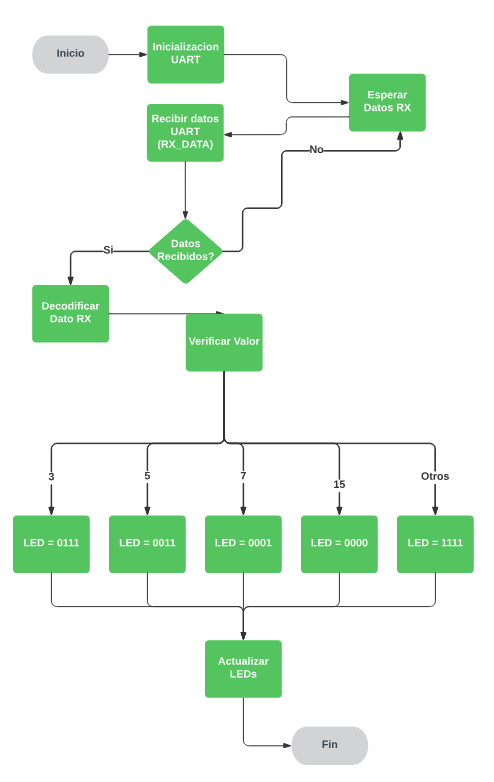
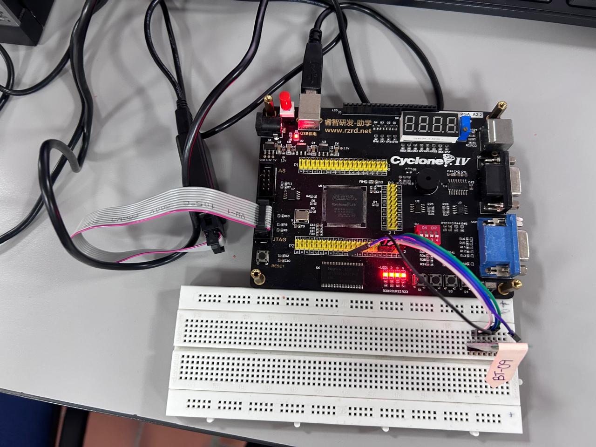
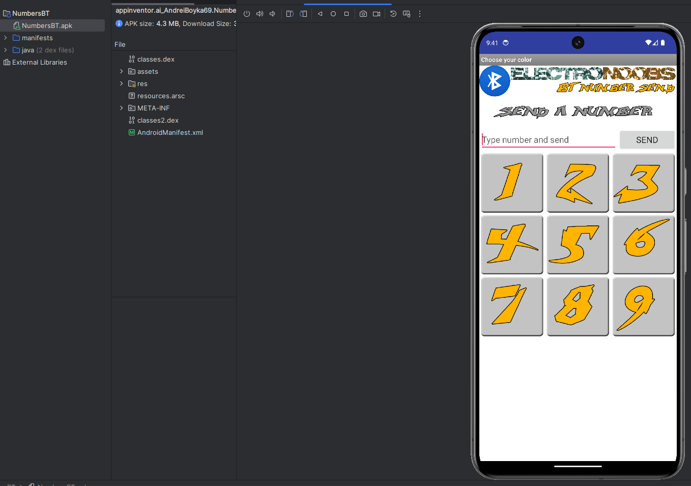

# Lab 3: Conexión Bluetooth con UART en FPGA

## Resumen
Este laboratorio busca implementar una interfaz UART (Universal Asynchronous Receiver-Transmitter) utilizando una FPGA (Field Programmable Gate Array). La FPGA recibirá datos a través del puerto UART para controlar el encendido y apagado de LEDs según los valores recibidos.

## Introducción
La comunicación serial asíncrona UART es clave en sistemas embebidos y electrónica digital para transferir datos entre dispositivos. Este laboratorio explora la implementación de UART en una FPGA y el procesamiento de datos para manejar LEDs. Una FPGA es un dispositivo programable que permite crear sistemas digitales complejos mediante configuraciones flexibles y reconfigurables.

## Marco Teórico

### Comunicación UART
UART es un protocolo serial asíncrono que facilita la transmisión de datos sin una señal de reloj dedicada. Se sincroniza usando bits de inicio y fin, transmitiendo bytes secuencialmente a través de un canal único.

### FPGA
Las FPGAs (Field Programmable Gate Arrays) son dispositivos semiconductores que integran bloques lógicos configurables para implementar circuitos digitales complejos. Su flexibilidad permite adaptarse a diversas aplicaciones con facilidad.

### Verilog y VHDL
Estos lenguajes de descripción de hardware (HDL) son esenciales para diseñar y sintetizar circuitos digitales, definiendo tanto el comportamiento como la estructura de sistemas electrónicos.

### Quartus Prime
Quartus Prime, desarrollado por Altera (Intel), es un entorno de desarrollo para diseñar, compilar y programar FPGAs. Integra herramientas para síntesis, asignación de pines y carga de diseños.

## Diagrama de Flujo


> Figura 1: Diagrama de Flujo del Controlador UART

## Código Comentado Línea a Línea

``` vhdl
-- Inclusion de librerías necesarias para operaciones logicas y aritmeticas
USE IEEE.STD_LOGIC_1164.ALL;
USE IEEE.STD_LOGIC_ARITH.ALL;

-- Definicion de la entidad del controlador
ENTITY CONTROLADOR IS 
    PORT(
        RX_DATA : IN STD_LOGIC_VECTOR(7 DOWNTO 0); -- Puerto de entrada para datos recibidos por UART
        LEDS : OUT STD_LOGIC_VECTOR(3 DOWNTO 0)   -- Puerto de salida para controlar 4 LEDs
    );
END ENTITY CONTROLADOR;

-- Arquitectura del controlador que define su comportamiento
ARCHITECTURE BEHAVIORAL OF CONTROLADOR IS
    -- Señal interna para almacenar el estado de los LEDs
    SIGNAL WIRE1 : STD_LOGIC_VECTOR(3 DOWNTO 0);
BEGIN
    -- Proceso que se activa cuando hay cambios en RX_DATA o WIRE1
    PROCESS(RX_DATA, WIRE1)
    BEGIN
        -- Estructura de casos para decodificar los datos recibidos
        CASE RX_DATA IS
            WHEN "0000011" => WIRE1 <= "0111";  -- Si se recibe 3, enciende LEDs en patron 0111
            WHEN "00000101" => WIRE1 <= "0011";  -- Si se recibe 5, enciende LEDs en patron 0011
            WHEN "000100111" => WIRE1 <= "0001";  -- Si se recibe 7, enciende LEDs en patron 0001
            WHEN "0001111" => WIRE1 <= "0000";  -- Si se recibe 15, apaga todos los LEDs
            WHEN OTHERS => WIRE1 <= "1111";      -- Para cualquier otro valor, enciende todos los LEDs
        END CASE;
    END PROCESS;

    -- Asignacion continua del valor de WIRE1 a los LEDs
    LEDS <= WIRE1;
END BEHAVIORAL;
```

## Explicación del código

### Inclusión de librerías
``` vhdl
USE IEEE.STD_LOGIC_1164.ALL; -- Tipos y operaciones lógicas estándar de VHDL.
USE IEEE.STD_LOGIC_ARITH.ALL; -- Operaciones aritméticas para vectores lógicos estándar.
```

### Declaración de la entidad

La entidad se llama **CONTROLADOR**.

Define dos puertos:

- `RX_DATA`: Un vector de entrada de 8 bits que representa los datos recibidos a través de UART.

- `LEDS`: Un vector de salida de 4 bits que se utilizará para controlar los LEDs.

### Arquitectura

La arquitectura se llama `BEHAVIORAL`, lo que significa que describe el comportamiento de la entidad.
Hay una señal llamada `WIRE1` que es un vector de 4 bits. Esta señal se utilizará para almacenar los valores de control de los LEDs.

### Bloque de proceso

Este bloque se activa cada vez que cambian las señales `RX_DATA` o `WIRE1`. Dentro del proceso, se utiliza una declaración `CASE` para verificar el valor de `RX_DATA`, dependiendo del valor de `RX_DATA`, se asigna un valor específico de 4 bits a la señal `WIRE1`:

- Si `RX_DATA` es `"0000011"` (decimal 3), `WIRE1` se establece en `"0111"`.
- Si `RX_DATA` es `"00000101"` (decimal 5), `WIRE1` se establece en `"0011"`.
- Si `RX_DATA` es `"000100111"` (decimal 7), `WIRE1` se establece en `"0001"`.
- Si `RX_DATA` es `"0001111"` (decimal 15), `WIRE1` se establece en `"0000"`.
Para cualquier otro valor de RX_DATA, `WIRE1` se establece en `"1111"`.

### Asignación de salida

La línea final asigna el valor de `WIRE1` al puerto de salida `LEDS`.

## Implementación en FPGA

Se usó un módulo Bluetooth para enviar datos desde un dispositivo móvil a la FPGA, conectado mediante UART. Durante las pruebas, surgieron dos inconvenientes:

1. Falta de un dispositivo Android físico: Se resolvió con un emulador en Android Studio.
2. Problemas de conexión Bluetooth: Posiblemente debido a configuraciones previas no verificadas.


> Figura 2: FPGA con módulo Bluetooth


> Figura 3: APK en el emulador de Android Studio

## Conclusiones

- Implementar UART en una FPGA facilita la comunicación serial con dispositivos externos.

- Verilog permite describir el comportamiento de circuitos digitales y manejar periféricos.

- Integrar módulos Bluetooth y UART amplía la funcionalidad de la FPGA, habilitando comunicación inalámbrica.

## Bibliografía

- [Comunicación UART en FPGA](https://nandland.com/uart-serial-port-module/)
- [Código UART con FPGA](https://electronoobs.com/eng_circuitos_tut26_code1.php)
- [APK para enviar datos a FPGA](https://electronoobs.com/eng_circuitos_tut26_app1.php)
- [Módulo Bluetootj HC-05](https://components101.com/wireless/hc-05-bluetooth-module)
- [Emulador de Android Studio](https://developer.android.com/studio/run/emulator)
